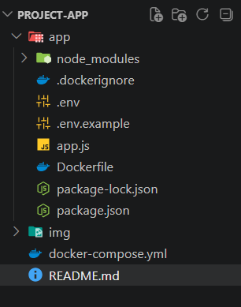
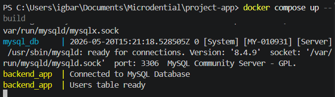
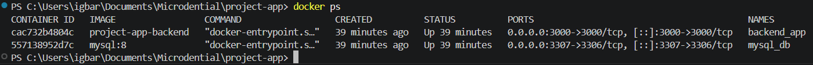
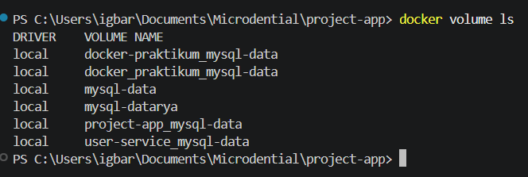
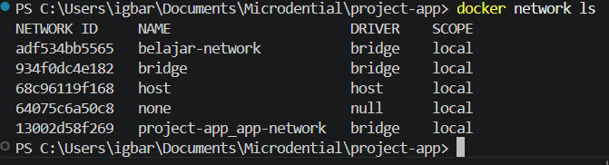
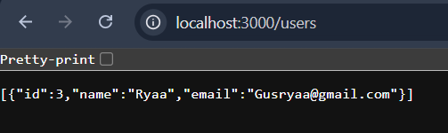
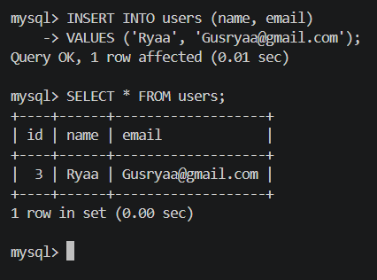
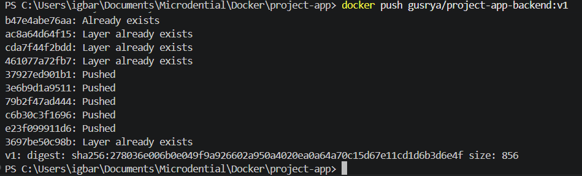
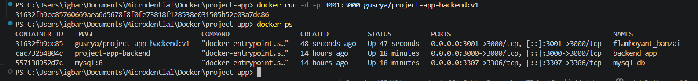

# Laporan Hasil Praktikum: Final Project Aplikasi Berbasis Container

## Identitas Mahasiswa

- **Nama:** I Gusti Bagus Arya Pratyusa Putra Dinata
- **NIM:** 2415354004
- **Kelas/Rombel:** 4D-TRPL
- **Tanggal Praktikum:** 20 Mei 2026

---

## Teknologi & Tools yang Digunakan

- **Sistem Operasi:** Windows 11
- **Containerization:** Docker & Docker Compose
- **Bahasa Pemrograman / Framework:** Node.js + Express.js
- **Database:** MySQL
- **Tools Lain:** VS Code, GitHub

---

# Langkah-Langkah Praktikum & Dokumentasi

## Langkah 1: Membuat Struktur Project

Pada tahap ini dilakukan pembuatan struktur project aplikasi backend Node.js yang terdiri dari Dockerfile, docker-compose.yml, environment variable, dan source code aplikasi.

Struktur project:

```bash
project-app/
│
├── app/
│   ├── Dockerfile
│   ├── .dockerignore
│   ├── .env
│   ├── package.json
│   └── app.js
│
├── docker-compose.yml
└── README.md
```

**Dokumentasi/Screenshot:**



---

## Langkah 2: Membuat Dockerfile dan Docker Compose

Pada tahap ini dilakukan konfigurasi Dockerfile untuk backend Node.js dan docker-compose.yml untuk menjalankan multi-container application antara backend dan database MySQL.

Perintah menjalankan Docker Compose:

```bash
docker compose up --build
```

**Dokumentasi/Screenshot:**



---

## Langkah 3: Pengujian Docker Compose, Volume, Network, dan Container

Pengujian dilakukan untuk memastikan container backend dan MySQL berjalan dengan baik serta terhubung melalui Docker Network dan Docker Volume.

Perintah pengujian:

```bash
docker ps
```

```bash
docker volume ls
```

```bash
docker network ls
```

Hasil pengujian menunjukkan:
- Container backend_app berjalan
- Container mysql_db berjalan
- Docker volume berhasil dibuat
- Docker network berhasil dibuat

**Dokumentasi/Screenshot:**







---

## Langkah 4: Pengujian Endpoint API Menggunakan Browser dan Postman

Pengujian endpoint dilakukan menggunakan Browser dan Postman untuk memastikan fitur CRUD User berjalan dengan baik.

### Endpoint GET /users

Request:

```bash
http://localhost:3000/users
```

Response:

```json
[]
```

### Endpoint POST /users

Request:

```json
{
  "name": "Govin",
  "email": ""
}
```

Response:

```json
{
  "message": "User added",
  "id": 1
}
```

### Endpoint GET /users Setelah Input Data

Response:

```json
[
  {
    "id": 1,
    "name": "Pinn",
    "email": "pinn@gmail.com"
  }
]
```

**Dokumentasi/Screenshot:**





---

## Langkah 5: Pengujian Upload ke Docker Hub

Pada tahap ini image backend diunggah ke Docker Hub agar dapat digunakan kembali pada environment lain.

Login Docker Hub:

```bash
docker login
```

Tag image:

```bash
docker tag project-app-backend USERNAME_DOCKERHUB/project-app-backend:v1
```

Push image:

```bash
docker push USERNAME_DOCKERHUB/project-app-backend:v1
```

Hasil pengujian:
- Image berhasil di-push ke Docker Hub
- Repository image berhasil dibuat

**Dokumentasi/Screenshot:**



---

## Langkah 6: Pengujian Pull dan Run Image Docker Hub

Pengujian dilakukan dengan melakukan pull image dari Docker Hub dan menjalankannya kembali menggunakan Docker.

Perintah:

```bash
docker pull USERNAME_DOCKERHUB/project-app-backend:v1
```

```bash
docker run -d -p 3000:3000 USERNAME_DOCKERHUB/project-app-backend:v1
```

**Dokumentasi/Screenshot:**



---

## Kendala dan Solusi

### Kendala:
- Container MySQL dan backend mengalami conflict name karena container lama masih berjalan.
- Backend gagal terkoneksi ke MySQL saat startup pertama.

### Solusi:
- Menghapus container lama menggunakan:
  
```bash
docker rm -f mysql_db
docker rm -f backend_app
```

- Menambahkan retry connection pada aplikasi Node.js agar menunggu MySQL siap digunakan.

---

# Kesimpulan

Praktikum berhasil dijalankan dengan menggunakan arsitektur multi-container menggunakan Docker Compose. Backend Node.js berhasil terhubung dengan database MySQL melalui Docker Network dan Docker Volume. Seluruh endpoint CRUD User berhasil diuji menggunakan Browser dan Postman. Selain itu image aplikasi juga berhasil diunggah ke Docker Hub.